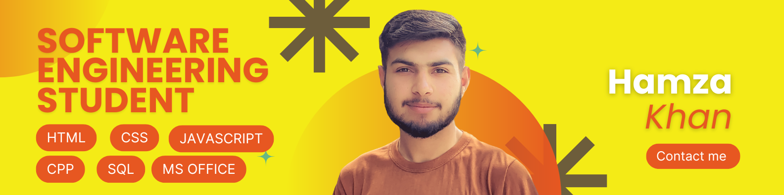

# 💫 About Me:
I’m a Software Engineering Student passionate about exploring the world of technology and building innovative solutions. Here’s a bit about me:  🎓 Currently pursuing a degree in Software Engineering. 💻 Learning and working with technologies like JavaScript, Python, C++, and Web Development. 🌱 Constantly improving my skills in full-stack development, algorithms, and problem-solving. 🚀 Interested in areas like Artificial Intelligence, Cloud Computing, and Mobile App Development. 🤝 Love collaborating on open-source projects and contributing to the tech community.  Skills: Languages: JavaScript, C++, HTML/CSS Tools:  VS Code, Canva, MS Office Areas of Interest: Web Development, Software Design  📈 What I’m Working On:  🔭 Building fun projects to enhance my portfolio. 🧠 Exploring new frameworks and libraries to stay updated with industry trends. 📝 Writing clean, efficient, and scalable code. 

## 🌐 Socials:
  

# 💻 Tech Stack:
      
# 📊 GitHub Stats:
 
 

### ✍️ Random Dev Quote

---

